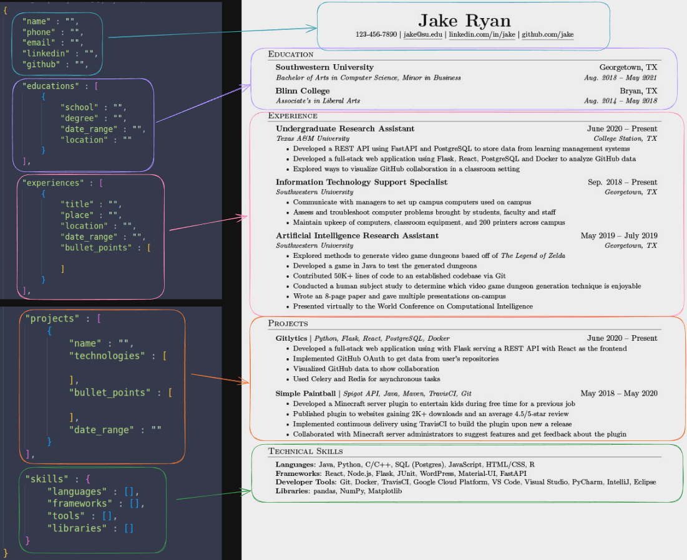

# jakes-jenerator
Generate a pdf resume using Jakes template from JSON input 


# How to use
- Fill in the src/input/resume.json file with resume information following the _template.json format \
(Note: any inputs that are in the form of an array ([]) can have additional elements added) \
(Extra Note: all arrays are composed of string elements e.g ["One", "Two"])

- Install the Docker engine on your system

- Run the following command
```
docker build -t jakes-jenerator . && docker run -v $(pwd)/src/output:/app/src/output --rm jakes-jenerator
```

- Navigate to src/output for the generated .tex file and .pdf both with the name jakes_resume.{pdf,tex}


# Prerequisites
- Must have Docker installed


# JSON Mapping
